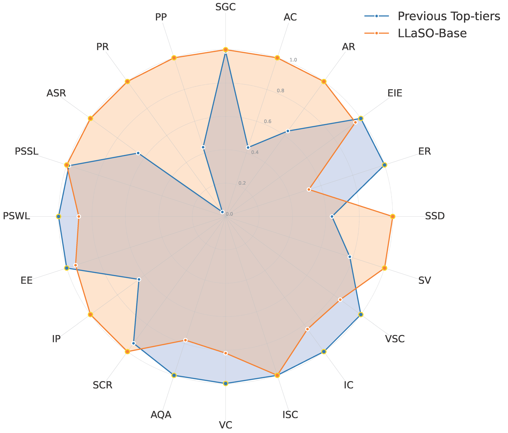
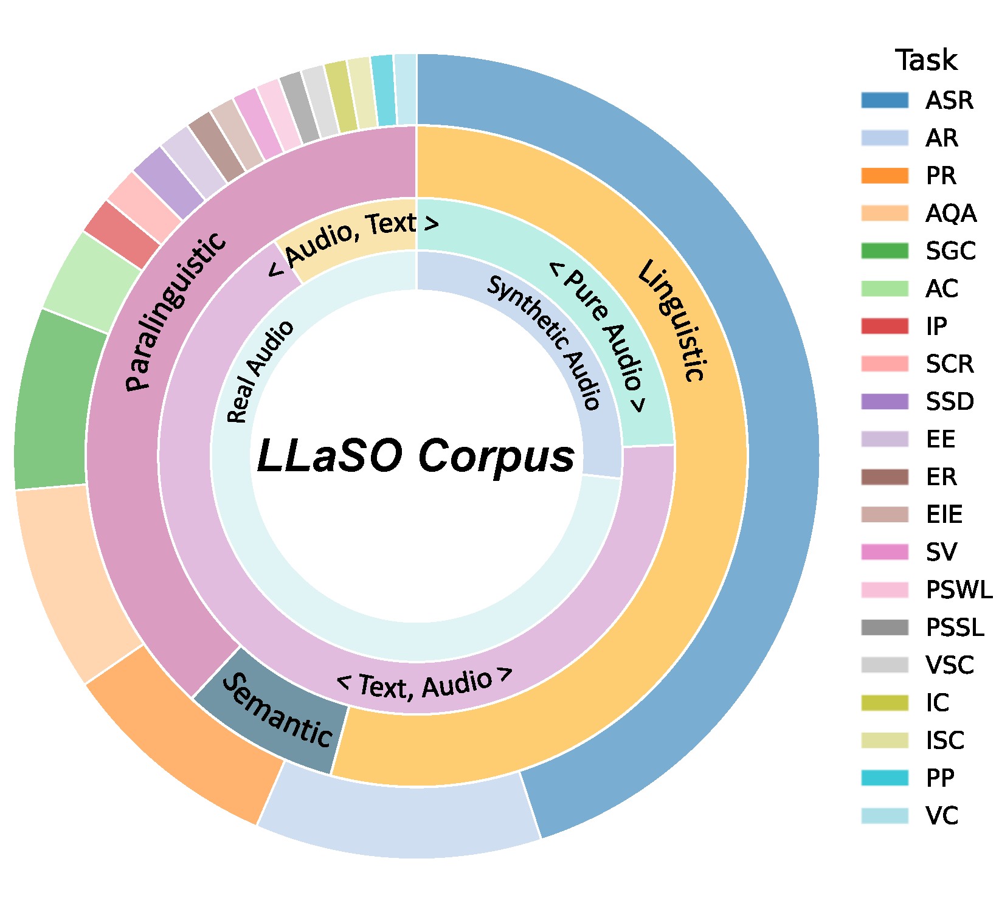
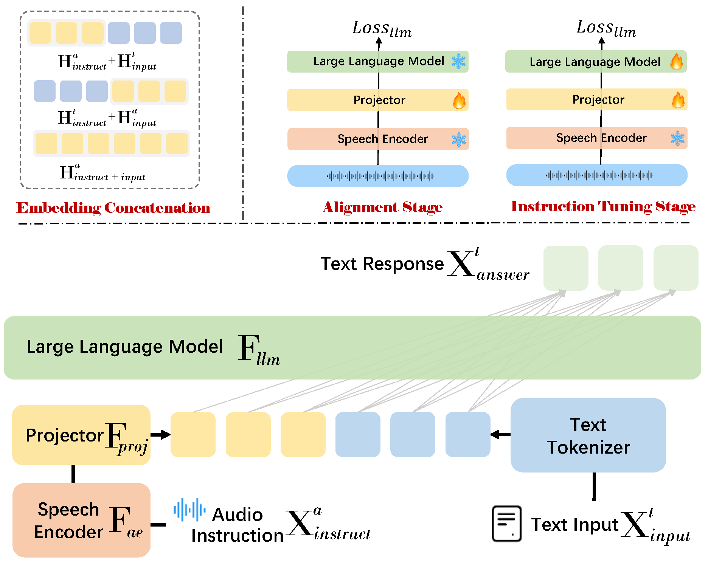
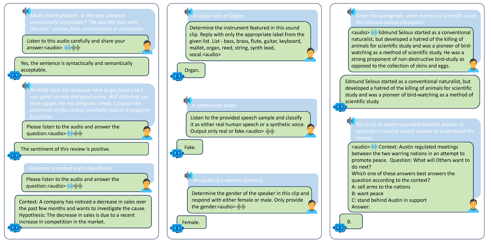
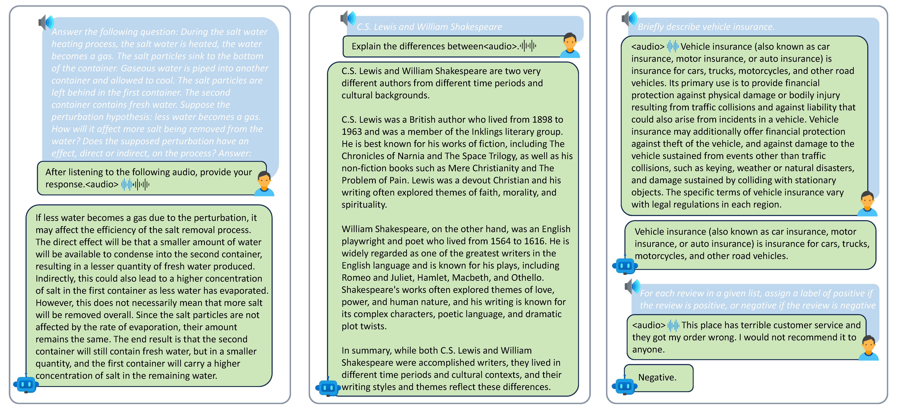

# LLaSO: A Reproducible Foundation for LargeSpeech-Language Models
*Fully open corpus + benchmark + reference model for compositional speech-language understanding.*


> **TL;DR.** 25.5M training samples, 20 tasks, 3 modality configurations; 15,044-sample stratified benchmark; 3.8B open reference model - an open-source LSLM stack.

<p align="center">
  
</p>
<p align="center"><i>
LLaSO-Base achieves the best normalized overall score on LLaSO-Eval across 20 tasks spanning linguistic, semantic, and paralinguistic categories.
</i></p>


<p align="center">
  If you find LLaSO useful, please ⭐ star this repo!
</p>

## 🔍 What is LLaSO?

**LLaSO is the first fully open, end-to-end stack for large-scale speech–language modeling, unifying data, evaluation, and modeling in one framework.**

- **LLaSO-Align (12.0M):** ASR-based alignment for grounding speech in textual semantic space.
- **LLaSO-Instruct (13.5M / 20 tasks / 3 modality configs):** Multi-task instruction tuning across linguistic, semantic, and paralinguistic objectives.
- **LLaSO-Eval (15,044):** Stratified benchmark for instruction-following and cross-modality generalization.
- **LLaSO-Base (3.8B):** Two-stage trained reference model, adapted from LLaVA-style architectures for robust compositional understanding.


<p align="center">
  <table>
    <tr>
      <td align="center">
        <br>
        <i>Corpus and Task Coverage</i>
      </td>
      <td align="center">
        <br>
        <i>Architecture & Two-Stage Training</i>
      </td>
    </tr>
  </table>
</p>
<p align='center'> <i>
LLaSO stack: Data, benchmark, and reference model for compositional speech–language modeling.
</i></p>

## ✨ Key Features

- **Fully Open, End-to-End Stack:** Unified release of corpus, benchmark, and model-enabling open-source research and fair comparison in speech-language modeling.
- **25.5M Samples, 20 Tasks, 3 Modality Configurations:** Supports all major text ↔ audio combinations (text + audio, audio + text, pure audio), covering linguistic, semantic, and paralinguistic tasks.
- **Stratified Evaluation (15,044):** Cohesive design between training and test sets enables systematic assessment of instruction following, cross-modality generalization, abstention rate, and stability.
- **Robust Reference Model (3.8B):** Two-stage training (ASR alignment → instruction tuning), easily reproducible and extensible for further research.
- **Empirical Insights:** Broader task and modality coverage consistently leads to stronger overall performance, but unseen modality/task configurations (especially pure audio) remain challenging; interleaving and parallel decoding strategies can bridge some gaps.
<a id="install"></a>
## 🛠️ Install
```bash
git clone https://github.com/EIT-NLP/LLaSO.git
cd LLaSO
conda create -n llaso python=3.10 -y
conda activate llaso
pip install --upgrade pip  # enable PEP 660 support
pip install -e .  # See pyproject.toml for dependencies
pip install librosa==0.10.2.post1

# Install additional packages for training
pip install -e ".[train]"

#install FlashAttention for acceleration
MAX_JOBS=8 pip install -v flash-attn --no-build-isolation
```
> **Tips:**  
> If you encounter issues with FlashAttention installation (e.g., build errors or the process getting stuck), we recommend manually downloading the appropriate FlashAttention 2 wheel from the [official Dao-AILab releases](https://github.com/Dao-AILab/flash-attention/releases).  
> For example, for `python3.10 + cu12.2 + torch2.1`, download:  
> 
> ```
> https://github.com/Dao-AILab/flash-attention/releases/download/v2.4.3.post1/flash_attn-2.4.3.post1+cu122torch2.1cxx11abiFALSE-cp310-cp310-linux_x86_64.whl
> ```
> and then install it via:  
> 
> ```bash
> pip install /path/to/flash_attn-2.4.3.post1+cu122torch2.1cxx11abiFALSE-cp310-cp310-linux_x86_64.whl
> ```

<a id="prepare-weights"></a>
## 📥 Prepare Model Weights

LLaSO relies on the following backbone weights before training or inference:

- **Audio encoder**: [openai/whisper-large-v3]
  Used as `--audio_tower` in training/inference scripts.

- **Base LLM**: [meta-llama/Llama-3.2-3B-Instruct] 
  Used as `--model_name_or_path` in training scripts.

- **LLaSO checkpoint**: [LLaSO-Base-3.8B-Instruct] 
  Used as `--model_path` in the inference example.

## 📂 Data Preparation

The training and alignment scripts expect a **single JSON file** as input.  
However, for flexibility, we release the instruction data in multiple subdirectories (e.g., `audio_text/`, `pure_audio/`, `text_audio/`).  

- This split format allows users to **explore or train with individual modality subsets**.  
- For full training, these subsets need to be **merged into one JSON**.  

We provide `/llaso/data/data_merge.py` for this purpose.  
Use it to combine the JSON files under each modality subdirectory into a single training file.  

> **Dataset Availability**  
> - ✅ **LLaSO-Eval** is already available on Hugging Face.  
> - ✅ **LLaSO-Instruct** has been fully uploaded and is available now.  
> - ⏳ **LLaSO-Align** is currently being uploaded (large dataset, uploading in parallel threads; this may take some time due to network limits).

<a id="quick-start"></a>
## 🚀 Quick Start


### 4.1 Training
Train LLaSO-Base from scratch with:
```python
# Stage 1: Speech-Text Alignment (ASR)
bash llaso/scripts/align.sh 

# Stage 2: Multi-task Instruction Tuning
bash llaso/scripts/finetune.sh 
```

### 4.2 Inference
Run model inference on your own data or evaluation set:
```python
python llaso/evaluation/model_eval.py \
  --audio_tower ./whisper-large-v3 \
  --model_path ./LLaSO-Base-3.8B-Instruct \
  --data_path ./LLaSO-Eval/your_eval.json \
  --output_dir ./your_output_dir
```

### 4.3 Evaluation
LLaSO provides flexible evaluation metrics for all supported tasks.
See the llaso/evaluation/metrics/ directory for dedicated metric scripts per task type.
> **Tip:**
> Refer to our paperfor detailed mapping of tasks to metrics and best practices.

> **Note:**
> Training and inference configs are fully modular; see scripts and configs for options.
## 📦 Model Zoo

| Model               | #Params | Training Data                | Modality Configs        | Normalized Score | Checkpoint          |
|---------------------|--------:|------------------------------|------------------------|------------------|---------------------|
| **LLaSO-Base**      | 3.8B    | LLaSO-Align + LLaSO-Instruct (25.5M) | (t,a), (a,t), (a)      | 0.72             | 🤗 HF link       |
| *(Future)* TBD | ...    | ...                          | ...                    | ...              | (coming)            |


## 🗃️ Data Cards

### **LLaSO Corpus Overview**
- **Composition:** 25.5M samples (12.0M Align + 13.5M Instruct) covering 20 tasks across all major modality configurations (text instr. with audio input, pure audio, audio instr. with text input).
- **Overall Task Distribution:** 52% linguistic, 8% semantic, 40% paralinguistic.
- **Real vs. Synthetic:** 71% real-world audio, 29% synthetic speech.
- **Design Motivation:** 
  - *Linguistic (ASR)* remains foundational for speech–text alignment and generalization.
  - *Semantic* tasks are intentionally underweighted, as their challenge lies more in language modeling than in speech understanding.
  - *Paralinguistic* tasks (speaker, accent, emotion, pronunciation scoring) are prioritized to address their underrepresentation in open datasets.
- **Flexible Modality Roles:** Both audio and text serve as input/instruction, enabling rich compositional interaction patterns.

---

### **LLaSO-Align (12.0M)**
- **Goal:** ASR-based alignment; encoder & LLM frozen, projector trained for speech-to-text semantic grounding.
- **Domains:** Conversational, narrative, audiobook, accented speech.
- **Templates:** 18 instruction types for ASR; unified JSON format for integration.

### **LLaSO-Instruct (13.5M / 20 tasks)**
- **Purpose:** Multi-task instruction tuning for robust, compositional understanding.
- **Task Types:** Spans linguistic, semantic, and paralinguistic objectives with a mix of closed- and open-ended formats.
- **Modality Configurations:**  
  - Text instruction + Audio input: **X**<sub>query</sub><sup>(t,a)</sup>
  - Audio instruction + Text input: **X**<sub>query</sub><sup>(a,t)</sup>
  - Pure audio: **X**<sub>query</sub><sup>(a)</sup>
- **Label Granularity:** Multi-granularity (e.g., coarse→fine age, accent).

### **LLaSO-Eval (15,044)**
- **Benchmarking:** Strictly stratified; consistent with training data.
- **Coverage:** All tasks and modality combinations.
- **Metrics:** Supports abstention rate analysis and cross-modality generalization evaluation.

<p align="center">
  
</p>
<p align="center"><i>
LLaSO data construction pipeline, from text QA and multi-source speech to two-stage training datasets.
</i></p>

<p align="center">
  <br>
  
</p>


<p align="center"><i>
Cases for input modality configurations and task prototypes illustrate LLaSO's compositional flexibility. Pure audio (top), text instruction with audio input (middle), and audio instruction with text input (bottom). Each figure presents distinct tasks under its respective format.
</i></p>

## 🔬 Key Empirical Findings

- **Broader task and modality coverage** consistently yields higher overall performance and lower abstention rates, though unseen configurations (especially pure audio) remain challenging.
- **Interleaving and parallel decoding strategies** can partially bridge cross-modality generalization gaps.
- **Unfreezing the audio encoder in Stage 2** improves semantic task performance but can reduce paralinguistic accuracy, highlighting a training-stage trade-off.
- **Speech-to-speech systems** with narrow task focus demonstrate stable cross-modality behavior but lag in overall capability.
- **LSLMs tend to favor content-related tasks**, while paralinguistic subtleties are generally more difficult.

